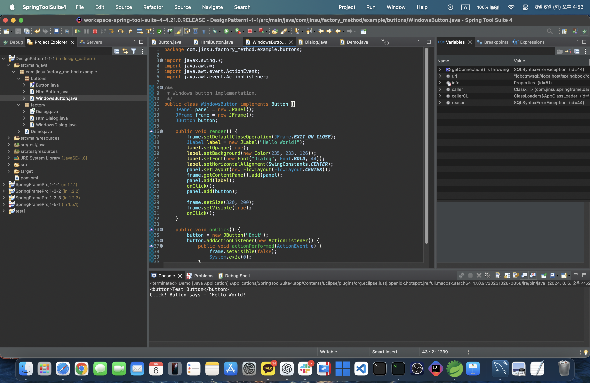
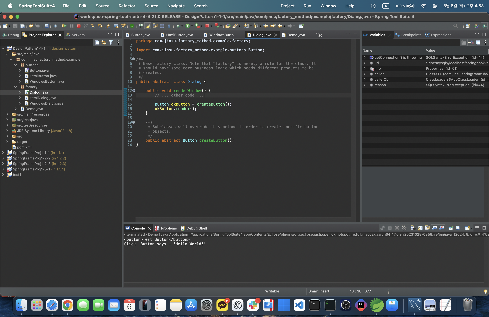
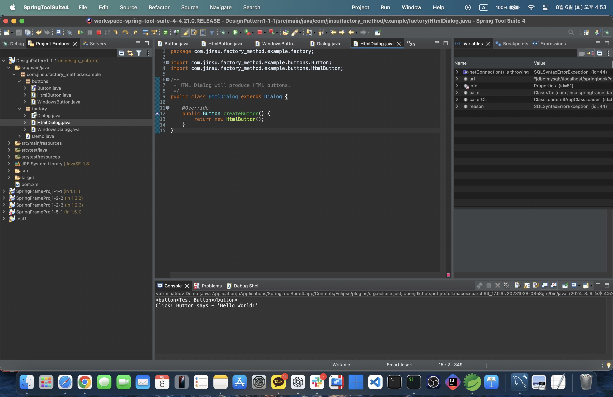
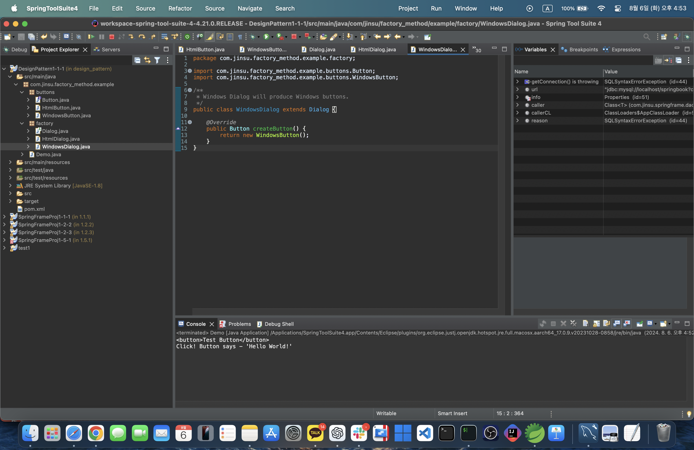
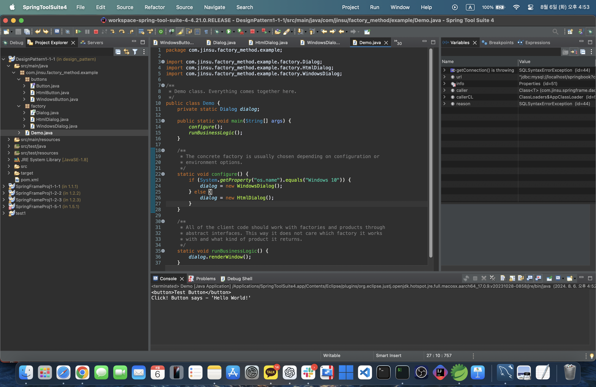
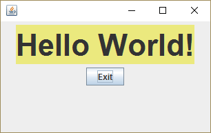

-  **Blog** : [Jinsu's Technical Blog](https://myinfo503.tistory.com)
  

# 크로스 플랫폼 그래픽 사용자 요소들의 생성
이 예시에서는 버튼들은 제품의 역할을 하고 다이얼로그들은 크리에이터의 역할을 합니다.
각 다른 다이얼로그 유형은 그의 고유한 요소 유형들이 필요합니다. 그러므로 각 다이얼로그 유형에 대한 자식 클래스를 만들고 해당 팩토리 메서드들을 오버라이드합니다.
이제 각 다이얼로그 유형은 적절한 버튼 클래스들을 인스턴스화할 것입니다. 기초 다이얼로그는 공통 인터페이스를 사용하는 제품과 함께 작동하므로 모든 변경 후에도 해당 기초 다이얼로그의 코드가 계속 작동할 것입니다.
***
## buttons
#### buttons/Button.java: 공통 제품 인터페이스

***
#### buttons/HtmlButton.java: 구상 제품

***
#### buttons/WindowsButton.java: 또 하나의 구상 제품

***
#### factory/Dialog.java: 기초 크리에이터

***
#### factory/HtmlDialog.java: 구상 크리에이터

***
#### factory/WindowsDialog.java: 또 하나의 구상 크리에이터

***
#### Demo.java: 클라이언트 코드

***
#### OutputDemo.png: 실행 결과 (WindowsDialog)

